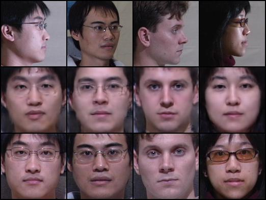
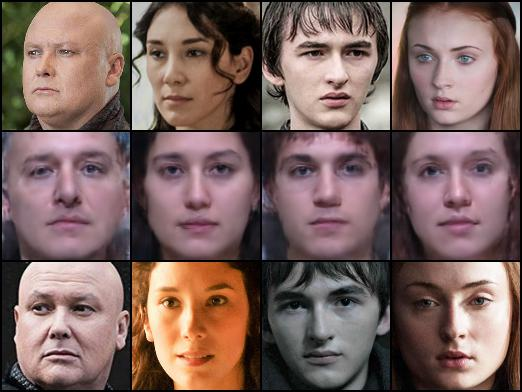
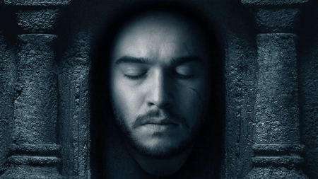

The enclosed `generator_v0.pt` is the Generator network of the [Frontalization GAN](https://github.com/scaleway/frontalization/blob/master/network.py) that has been trained on the [CMU Multi-PIE Face Database](http://www.cs.cmu.edu/afs/cs/project/PIE/MultiPie/Multi-Pie/Home.html) for 18 epochs. All images of the following subjects were excluded from training and used for validation: those numbered `214` through `236`, and `346`.

Hyperparameters used: as those listed in [`main.py`](https://github.com/scaleway/frontalization/blob/master/main.py), except for the following:
```
L1_factor = 1
L2_factor = 1
GAN_factor = 0.001
```

Additionally, `GAN_factor` was set to zero for all odd-numbered epochs. Such alternating GAN on/off manner of training served as a regularization mechanism and resulted in more realistic-looking images at the end.

The images in the Multi-PIE set are taken at set angles and lighting conditions. Although the training set contained around 650 000 image profile-frontal pairs, the number of unique subjects used for training was only around 300. This, and the lack of diversity in the set are the likely reasons why the final model does not generalize particularly well beyond the test set taken from the Multi-PIE Database (naturally, excluded during training). Within that test set it does, however, demonstrate reasonable performance even for large angle inputs:



(Top row: inputs; middle row: model outputs; bottom row: ground truth images)

Outside of Multi-Pie, the model performs best on images of dark haired caucasian and asian individuals without facial hair (sadly, the latter places a severe limitation on running inference on Game of Thrones characters):



The figures above were generated using the code found in [`test.py`](https://github.com/scaleway/frontalization/blob/master/test.py). If using your own inference code, take care to use the same normalization procedures as in [`data.py`](https://github.com/scaleway/frontalization/blob/master/data.py) and resize images to 128x128. Enjoy!


